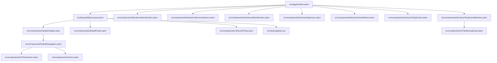
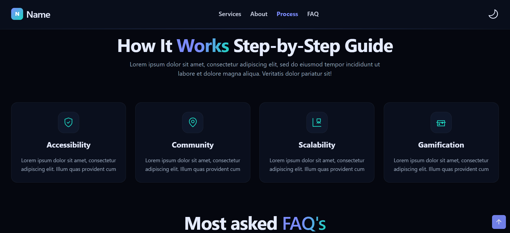

# Landing Page 02

A modern, responsive agency-style landing page built with Astro 6 and Tailwind CSS 4.

It includes:

- Light and dark theme support with persisted user preference.
- Sticky header with active section highlighting.
- Mobile navigation with animated open/close behavior.
- Modular section-based architecture for easy customization.
- SEO-ready base layout with Open Graph and Twitter meta tags.
- Auto-generated sitemap integration.

## Live Sections

The homepage is composed of reusable sections rendered in this order:

1. Hero
2. Services
3. About
4. Sponsors
5. How It Works
6. FAQ
7. Testimonials

## Tech Stack

- Astro `^6.1.4`
- Tailwind CSS `^4.2.2`
- `@tailwindcss/vite` `^4.2.2`
- `@astrojs/sitemap` `^3.7.2`
- Prettier + `prettier-plugin-astro`

## Requirements

- Node.js `>=22.12.0`
- pnpm

## Getting Started

```bash
pnpm install
pnpm dev
```

The local dev server runs at `http://localhost:4321` by default.

## Scripts

| Command        | Description                            |
| :------------- | :------------------------------------- |
| `pnpm dev`     | Start the Astro development server     |
| `pnpm build`   | Build the production output in `dist/` |
| `pnpm preview` | Serve the production build locally     |
| `pnpm format`  | Format the project using Prettier      |
| `pnpm astro`   | Run Astro CLI commands                 |

## Project Architecture

### High-Level Diagram



### Folder and File Tree

```text
.
├── astro.config.mjs
├── package.json
├── pnpm-lock.yaml
├── pnpm-workspace.yaml
├── tsconfig.json
├── public/
│   └── robots.txt
└── src/
	 ├── env.d.ts
	 ├── assets/
	 │   ├── landing-page-img-02.png
	 │   └── landing-page-img-2-02.png
	 ├── components/
	 │   ├── Global/
	 │   │   ├── Footer.astro
	 │   │   ├── Header.astro
	 │   │   └── Navigation.astro
	 │   ├── Sections/
	 │   │   ├── AboutSection.astro
	 │   │   ├── FaqSection.astro
	 │   │   ├── HeroSection.astro
	 │   │   ├── HowItWorks.astro
	 │   │   ├── ServicesSection.astro
	 │   │   ├── Sponsors.astro
	 │   │   └── TestimonialSection.astro
	 │   └── UI/
	 │       ├── HeadingText.astro
	 │       ├── Icon.astro
	 │       ├── ScrollToTop.astro
	 │       ├── TestimonialCard.astro
	 │       └── ThemeIcon.astro
	 ├── layouts/
	 │   └── BaseLayout.astro
	 ├── pages/
	 │   └── index.astro
	 └── styles/
		  └── global.css
```

## File-by-File Explanation

### Root Configuration

- `astro.config.mjs`: Defines project site URL, adds Tailwind Vite plugin, and enables sitemap integration.
- `package.json`: Project metadata, Node engine requirement, npm scripts, and dependencies.
- `tsconfig.json`: TypeScript configuration used by Astro tooling.

### Layout and Routing

- `src/pages/index.astro`: Main route composition; imports and orders all homepage sections.
- `src/layouts/BaseLayout.astro`: Global HTML shell, meta/SEO tags, theme bootstrap script, and shared layout wrappers.

### Global Components

- `src/components/Global/Header.astro`: Sticky top header with logo and navigation container.
- `src/components/Global/Navigation.astro`: Desktop/mobile navigation, active link observer, and menu interactions.
- `src/components/Global/Footer.astro`: Multi-column footer links and branding block.

### Section Components

- `src/components/Sections/HeroSection.astro`: Primary headline, CTA buttons, and intro KPI cards.
- `src/components/Sections/ServicesSection.astro`: Service offering cards in a responsive grid.
- `src/components/Sections/AboutSection.astro`: About block with placeholder illustration area and metrics.
- `src/components/Sections/Sponsors.astro`: Sponsor/partner strip with hover-enhanced presentation.
- `src/components/Sections/HowItWorks.astro`: Step-by-step features with icon-led cards.
- `src/components/Sections/FaqSection.astro`: Expandable FAQ list built with semantic `details/summary`.
- `src/components/Sections/TestimonialSection.astro`: Marquee-style testimonials with continuous horizontal motion.

### UI Primitives

- `src/components/UI/HeadingText.astro`: Reusable heading abstraction with optional gradient text segment.
- `src/components/UI/Icon.astro`: Internal icon switch component for menu, close, arrow, and social icons.
- `src/components/UI/ThemeIcon.astro`: Light/dark toggle button and localStorage theme persistence.
- `src/components/UI/ScrollToTop.astro`: Floating button that appears on scroll and smoothly returns to top.
- `src/components/UI/TestimonialCard.astro`: Reusable testimonial presentation card.

### Styling and Assets

- `src/styles/global.css`: Design tokens, theme variables, global styles, and reusable utility classes.
- `src/assets/*`: Project images used for visual references and design assets.
- `public/robots.txt`: Search crawler instruction file.

## Theme System

The theme behavior is implemented in two layers:

1. Initial theme bootstrapping in `BaseLayout.astro`:
   - Reads saved preference from `localStorage`.
   - Falls back to system preference if no manual choice exists.
2. Runtime switching in `ThemeIcon.astro`:
   - Toggles `dark` and `light` classes on `<html>`.
   - Persists the user choice.

Color tokens and theme surfaces are centralized in `src/styles/global.css` for easy design updates.

## SEO and Metadata

`BaseLayout.astro` includes:

- Dynamic page title and description
- Optional canonical URL
- Open Graph metadata
- Twitter card metadata
- Sitemap and icon references

## Landing Page Preview

### Dark Mode


### Light Mode



## Customization Guide

Typical edits you may want:

- Brand name/logo: update `src/components/Global/Header.astro`
- Navigation items and anchors: update `src/components/Global/Navigation.astro`
- Hero copy and CTAs: update `src/components/Sections/HeroSection.astro`
- Services/About/Process content: update section files in `src/components/Sections/`
- FAQ content: update `faqs` array in `src/components/Sections/FaqSection.astro`
- Theme colors and spacing scales: update CSS variables in `src/styles/global.css`

## Build and Preview

```bash
pnpm build
pnpm preview
```

Use this flow to validate the production output before deployment.

## Notes

- The current `site` in `astro.config.mjs` is a placeholder and should be replaced with your real domain for correct sitemap and canonical behavior.
- Some section content still uses placeholder copy and can be replaced with production content at any time.
